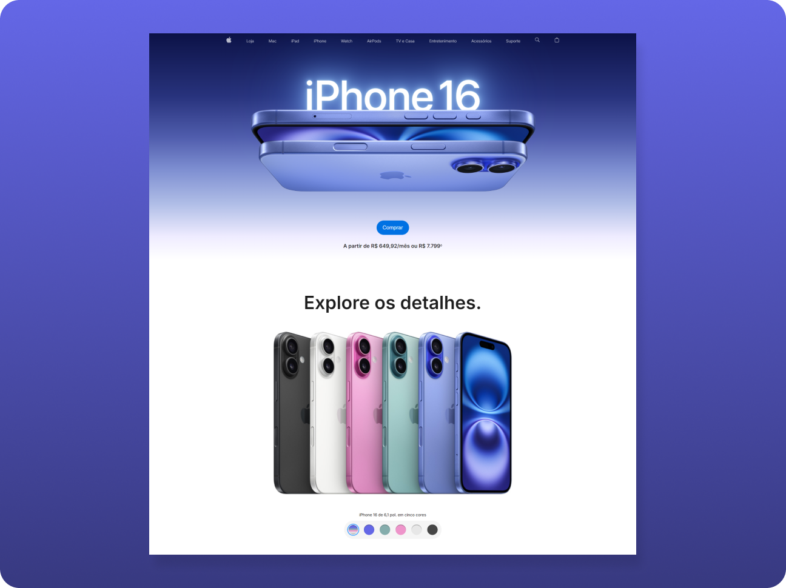

# 🍏 Landing Page iPhone 16

 

    <h2>🎯 Sobre o Projeto</h2>
    Este é o terceiro projeto com <strong>JavaScript</strong>, focado em reproduzir interações de uma parte da landing page do novo iPhone 16.

 

## 👨🏾‍💻 Desafio do Projeto
 
O desafio consistiu em criar uma experiência interativa que permitisse aos usuários selecionarem suas opções de acordo com as cores disponíveis.

 

## 📸 Screenshots

 

## 🏆 Aprendizados 

- Seleção de elementos com forEach
- Tempo de transição com setTimeout
- Eventos de clique/alternância com método toggle
- Atualização de conteúdo utilizando a propriedade textContent

 

## 🚀 Tecnologias Utilizadas

- JavaScript (ES6)
- HTML5
- CSS3

 

## 🔗 Projeto On-line
Este projeto está disponível para visualização on-line.  
Você pode acessá-lo através do link: https://iphone16-vert.vercel.app/

 

##

    Este projeto foi desenvolvido como parte do curso <strong>Formação Front-end - HTML, CSS, JavaScript, React e +</strong>, ministrado por <strong>Matheus Battisti</strong> da Escola de Programação <strong>🕒 Hora de Codar</strong>.

